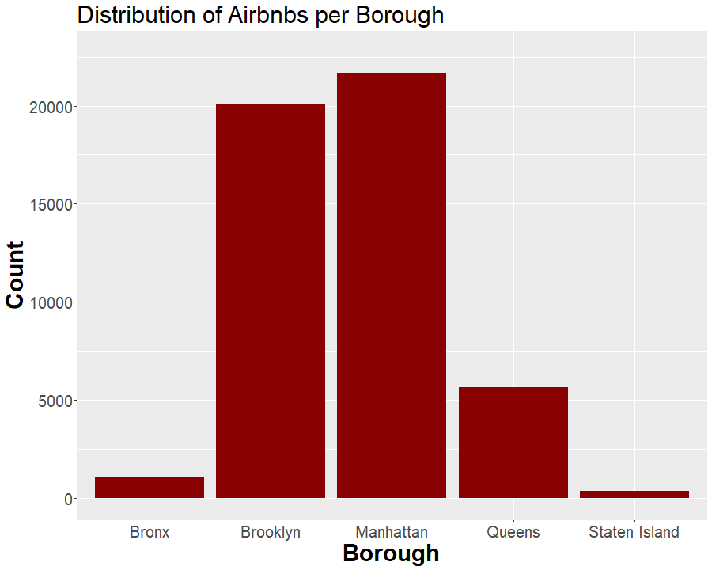
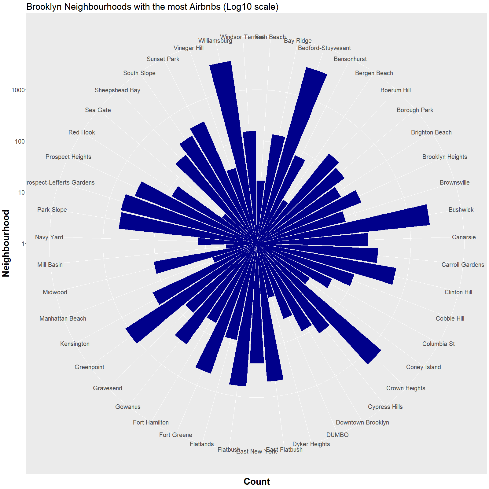
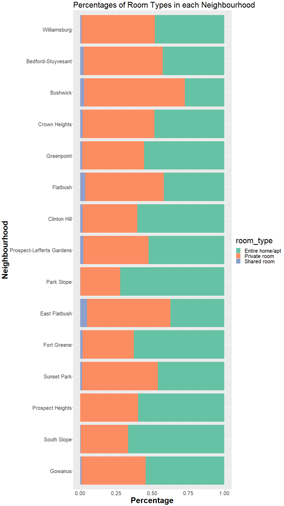
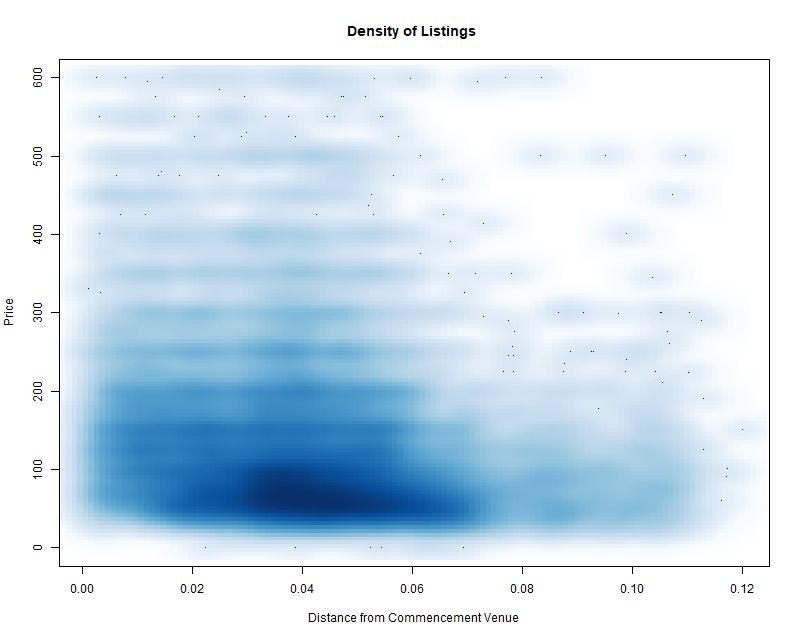
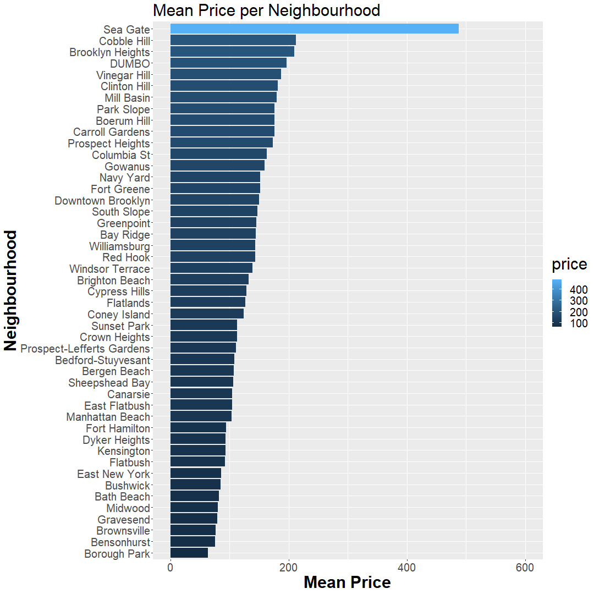
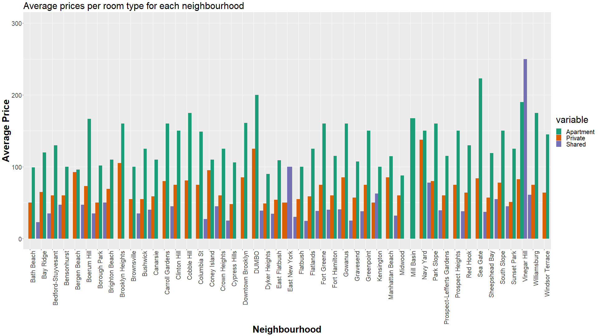

Disclaimer: This project was undertaken pre-COVID
## Motivation

I graduate in May. My parents are coming in from India for my graduation, and they'll be in the city for a few days. Since I live with roommates, I can't really have them stay at my place, so I need to book an Airbnb for us. My motivation to undertake this project is to find out the most value-for-money deal on Airbnbs in New York City.

The project uses the NYC Airbnb data obtained from Kaggle. <a href="https://www.kaggle.com/dgomonov/new-york-city-airbnb-open-data#AB_NYC_2019.csv">Dataset Link</a>

## What borough do I live in?
If I'm looking for a place to stay, I am looking at multiple options so that one of them would fit my needs. Also, my commencement ceremony will happen in Brooklyn, so I already have a preference for where my Airbnb should be. So, a count of the number of listings in each borough is obtained.

## ...and which neighbourhood?

I'm in luck! Brooklyn has the second highest number of Airbnb listings. Which means I have options to find a place that works for mom and dad. Now, I need a place that is easily accessible by public transport, close to university, or close to the commencement venue, or in a neighbourhood I know. So here's a look at the neigbourhoods with most Airbnb listings.

After selecting all Brooklyn listings, getting a count of number of listings per neighbourhood, sorting the neighbourhoods by decreasing number of listings, and finding the top 15 neighbourhoods with most listings, here's what we have:

## How are the rooms distributed?
With three, probably more, people involved, it is imperative that I have at least a private room or apartment. We shall examine the kinds of room types these listings actually are. After creating a two-way table with neighbourhood and room type, we look at room types.

Now, when you look at room_types, it lists the data from all the neighbourhoods in the entire city. We really just need the room types of the top 15 neighbourhoods in Brooklyn.

## How far are the listings?
We calculate the Euclidean distance of each listing from the commencement venue. The smooth scatter plot plots the density of observations in a particular region. The darker the color, the more number of points in the region.

From the image, we observe that most of the listings under a hundred dollars are available in the regions that are around an euclidean distance of 0.04 from the commencement venue.

## More insights on prices
For each neighbourhood in Brooklyn, the average prices are plotted. It is seen that as you move closer to downtown Brooklyn, the prices rise.

Now, we'll also find the median price for each room type in each neighbourhood. Steps to obtain this chart are available in the file `main3.R`

